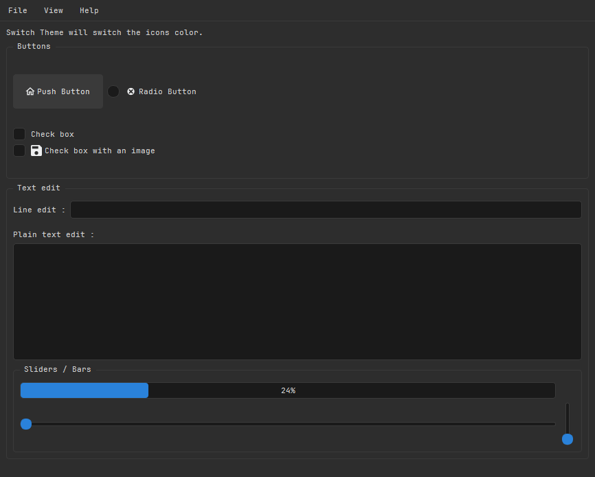
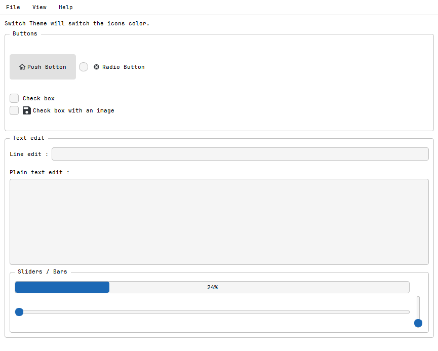

# PyQt6 GUI Template


A simple, modern, and extensible template for creating GUI applications with PyQt6. It features a theming system with dark and light modes, where icons automatically adapt to the selected color scheme.

## Features

- **Adaptive Theming & Dynamic Icons:** Seamlessly switch between Dark and Light themes, icons automatically adapt to the selected color scheme.
- **Qt Designer Ready:** The UI is built using `.ui` files, making it easy to visually edit layouts without touching Python code.
- **CSS Styling:** Themes are defined in standard `.css` files for easy customization.
- **Typography:** Uses the JetBrains Mono font, chosen because i like it.

## Screenshots

### Dark Theme


### Light Theme


## Getting Started

### Prerequisites
- Python 3.x
- `pip`

### Installation

1.  **Clone the repository:**
    ```bash
    git clone https://github.com/crowdedmovie/pyqt6_gui_template.git
    cd pyqt6_gui_template
    ```

2.  **Install dependencies:**
    ```bash
    pip install PyQt6
    ```

3.  **Run the application:**
    ```bash
    python main.py
    ```

## Development Workflow

### Building your UI
1.  Open `gui/gui_interface.ui` in **Qt Designer** to modify the user interface.
2.  After modifying the `.ui` file, regenerate the Python code:
    - **Using the build script:**
      ```bash
      python gui/build.py
      ```
    - **Or manually via CLI:**
      ```bash
      pyuic6 -x gui/gui_interface.ui -o gui/gui_interface.py
      ```

### Compiling Resources (`.qrc`)
The application uses a `.qrc` file to manage icons. If you add new icons, you must recompile this file.

- **For PyQt6:**
  ```bash
  pyrcc6 icons/breeze.qrc -o icons/resources_rc.py
  ```
- **For PySide6:**
  ```bash
  pyside6-rcc icons/breeze.qrc -o icons/resources_rc.py
  ```
  *Note: If using PySide6 tools, remember to change the import in the generated file from `PySide6` to `PyQt6`.*

- **On Windows (Alternative):**
  You can use `rcc.exe`, typically found in `%LOCALAPPDATA%\Programs\Python\Python313\Lib\site-packages\qt6_applications\Qt\bin`.
  ```bash
  rcc.exe -g python icons/breeze.qrc -o icons/resources_rc.py
  ```

## Theming & Icons

### Automatic Icon Switching
To enable automatic icon switching between dark and light themes, you must set a custom property in Qt Designer for any widget with an icon.

1.  **Property Name:** `icon_name`
2.  **Value:** The filename of the icon (without path or extension).
    *   *Example:* For `icons/light/cancel.svg` and `icons/dark/cancel.svg`, set `icon_name` to `cancel`.

*Note: Both light and dark icon folders must contain a file with the same name.*

### Themed Widgets
The following widgets have custom styling defined in the CSS files:
- **Containers:** `QMainWindow`, `QWidget`, `QGroupBox`, `QScrollArea`, `QTabWidget`, `QTabBar`
- **Controls:** `QPushButton`, `QCheckBox`, `QRadioButton`, `QSlider`, `QProgressBar`
- **Input:** `QLineEdit`, `QTextEdit`, `QPlainTextEdit`, `QSpinBox`, `QDoubleSpinBox`, `QComboBox`
- **Views:** `QTableWidget`, `QListWidget`, `QTreeWidget`, `QHeaderView`
- **Menus:** `QMenuBar`, `QMenu`
- **Misc:** `QScrollBar`, `QToolTip`

### Unthemed Widgets
These widgets inherit default styles:
- `QLabel`, `QToolBar`, `QStatusBar`
- `QDial`, `QLCDNumber`
- `QDateTimeEdit`, `QCalendarWidget`

## Project Structure

- **`main.py`**: The application entry point.
- **`gui/main_window.py`**: Contains the core logic, signal connections, and theme switching implementation.
- **`gui/gui_interface.ui`**: The visual layout file (editable in Qt Designer).
- **`themes/`**: Contains the `dark.css` and `light.css` stylesheets.

## Credits

Icons are from [BreezeStyleSheets](https://github.com/Alexhuszagh/BreezeStyleSheets).

## License

This project is licensed under the GPLv3 License - see the LICENSE file for details.
